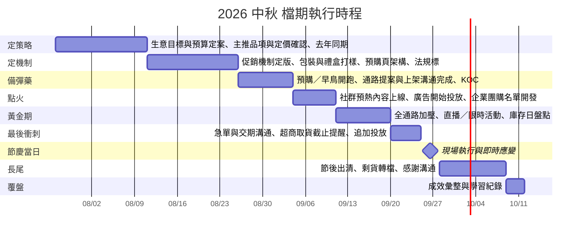

# 完整範例：2026 中秋，一個虛構烘焙品牌跑完五個 skill

## 怎麼用這份檔

**想快速評估這套 skill 值不值得裝**：直接往下讀。每一段都標了哪些是程式算出來的、哪些是被標記的假設，讀完你會知道這套東西的產出長什麼樣、以及它拒絕做什麼。

**想自己跑一次**：把每一段開頭「你輸入」框裡的字複製給 Claude，照順序跑五次。全程使用這個庫裡現成的 `templates/sales_template.csv`（2025 中秋檔期示範資料，156 列，三通路），**不需要自備任何資料**。你跑出來的數字會跟這份文件一模一樣，因為腳本只做算術。

---

## 這份文件的鐵律

全文的數字只有兩種：

1. **程式算出來的**——`analyze_sales.py` 或 `backplan.py` 的實跑輸出，逐字照抄。
2. **標為假設的**——寫成 `[假設] <數字> — 依據：<怎麼推的> — 需驗證：<怎麼驗>`。

沒有第三種。看到一個數字既不在腳本輸出裡、又沒有 `[假設]` 標記，那就是這份文件的 bug。

> **什麼不算數字**：章節與清單編號、概念與軸的編號、清單計數（「6 張概念卡」「12 條假設」）、評分等第（1-5 分）、物料件數（「圖 3 張」），以及取自 `templates/content-calendar.csv` 的平台素材尺寸（1080x1350、1200x628）。這些是文件結構與規格常數，不是業務估計值，因此不掛 `[假設]`。評分沿用 `mechanic-library.md` 的立場：**定性判斷的排序工具，不是估算值。**

---

## 情境設定（虛構品牌）

> ⚠️ 以下品牌、人名、通路關係全部是虛構的，用來讓範例讀起來像真的案子。任何要拿去用的數字，請換成你自己的。

**品牌**：月見堂，中型烘焙品牌，主力商品是低糖月餅禮盒。電商為主戰場，超市與便利商店為輔。

`festival-campaign-ideas` 要求的 brief 六格：

| 格 | 內容 |
|---|---|
| **生意目標** | 衝量為主、拉新為輔。要在中秋檔期把電商的新客佔比拉起來，同時不讓禮盒的送禮價值被折扣稀釋。 |
| **節慶與日期** | 中秋，2026-09-25（週五）。日期取自 `backplan.py` 實跑輸出，日期精確度「確定」。 |
| **品類** | 食品飲料（`category-profiles.md` 標籤：`食品飲料`）。消費任務含送禮、團聚、儀式；節後長尾短，剩貨壓力大。 |
| **目標受眾** | 主購者是「買禮盒送長輩、送客戶」的送禮決策者；使用者是收禮方。掏錢的人與吃的人不是同一批，文案要對掏錢的人講。（刻意不寫年齡區間——範本明說「受眾寫『25-45 歲女性』就結束」是不合格的填法，而且那個區間也沒有資料支撐。） |
| **預算級距** | 中。**brief 階段只給級距，不給金額**——金額要等第三段用反推法拆成一串可以逐條驗證的假設，才有意義。 |
| **硬限制** | 禮盒外盒有打樣與印製交期；低糖配方的保存期比傳統月餅短；超商只吃小規格；今天是 2026-09-02，`backplan.py` 已警告落後（見第三段）。 |

---

## 第一段：看懂去年發生了什麼（festival-sales-analysis）

### 你輸入

```
我要規劃 2026 中秋檔期，先看去年的數字。
請用 templates/sales_template.csv 跑促銷成效分析，
我想知道 promotional lift、銷售高峰落在哪幾天、哪一種促銷類型賣得最好，
以及節後多久掉下來。
```

### 實跑

Claude 會執行：

```bash
python3 skills/festival-sales-analysis/scripts/analyze_sales.py templates/sales_template.csv
```

以下五節**逐字取自這道指令的實際輸出**。唯一的改動是把腳本原本的 `##` 標題降成 `####`，避免與本文的目錄打架；文字、表格與數字一字未改。完整報告還有「資料品質」「通路貢獻」「商品排行」「這份分析不能證明什麼」等節，這裡只挑對規劃最關鍵的五節。

---

#### 總覽

| 項目 | 值 |
| --- | --- |
| 資料期間 | 2025-09-08（週一） ～ 2025-10-16（週四） |
| 日曆天數 / 有紀錄天數 | 39 天 / 39 天 |
| 總銷售額 | 30,675,000 元 |
| 平均日銷（有紀錄日） | 786,538 元 |
| 平均日銷（含無紀錄日，除以日曆天） | 786,538 元 |
| 總銷售數量 | 50,214 |
| 平均單價（銷售額 ÷ 數量） | 611 元 |
| 促銷日 / 非促銷日 | 26 天 / 13 天 |

平均單價是「銷售額 ÷ 銷售數量」的加權均價，**不是客單價 AOV**。AOV 需要訂單筆數，這份資料裡沒有；要看 AOV 請另外匯出訂單層級資料。

#### Promotional lift

基準定義：資料期間內**所有非促銷日**的平均日銷。

| 範圍 | 促銷日數 | 促銷平均日銷 | 非促銷日數 | 非促銷平均日銷 | lift | 備註 |
| --- | --- | --- | --- | --- | --- | --- |
| **全站** | 26 | 1,058,462 | 13 | 242,692 | +336.1% |  |
| 電商 | 26 | 685,731 | 13 | 138,615 | +394.7% |  |
| 超市 | 26 | 279,923 | 13 | 69,385 | +303.4% |  |
| 便利商店 | 26 | 92,808 | 13 | 34,692 | +167.5% |  |

平均日銷的分母是「該範圍有銷售紀錄的天數」，不是日曆天。

分通路各算一次是為了避免通路組合變化被誤讀成促銷效果（例如促銷期多開了一個高單價通路，全站數字就會動）。各通路的 lift 差距很大時，全站那一列就不能單獨拿去報告。

#### 銷售高峰

##### 滾動 7 日最大窗口

- 期間：2025-09-30（週二） ～ 2025-10-06（週一）
- 窗口銷售額：13,511,000 元，佔資料期間總額 44.0%
- 窗口內促銷日：7 / 7 天

##### 單日前 5 名

| # | 日期 | 銷售額 | 佔總額 | 檔期狀態 |
| --- | --- | --- | --- | --- |
| 1 | 2025-10-04（週六） | 2,617,000 | 8.5% | 促銷 |
| 2 | 2025-10-05（週日） | 2,617,000 | 8.5% | 促銷 |
| 3 | 2025-10-06（週一） | 2,279,000 | 7.4% | 促銷 |
| 4 | 2025-10-03（週五） | 2,008,000 | 6.5% | 促銷 |
| 5 | 2025-09-29（週一） | 1,330,000 | 4.3% | 促銷 |

#### 促銷類型比較

| 促銷類型 | 有活動天數 | 該類型銷售額 | 平均日銷 | 相對非促銷基準 | 備註 |
| --- | --- | --- | --- | --- | --- |
| 滿千折百 | 15 | 7,784,000 | 518,933 | 2.14x |  |
| 買一送一 | 15 | 7,581,000 | 505,400 | 2.08x |  |
| 滿額贈 | 15 | 5,480,000 | 365,333 | 1.51x |  |
| 早鳥預購 | 7 | 3,523,000 | 503,286 | 2.07x |  |
| 出清特價 | 4 | 3,152,000 | 788,000 | 3.25x | 樣本不足，僅供參考（僅 4 天） |

非促銷基準平均日銷：242,692 元（13 天）。

⚠️ 各類型的天數、通路、商品組合都不一樣，這張表只能說「哪一種在當時賣得多」，不能當成「哪一種機制比較有效」。要比機制效果需要同期同通路的對照設計。

#### 節後衰退

- 高峰日：2025-10-04（週六），2,617,000 元（促銷日）
- 跌破高峰 50%（1,308,500 元）：高峰後第 3 天，2025-10-07（週二），當日 788,000 元
- 跌破高峰 20%（523,400 元）：高峰後第 7 天，2025-10-11（週六），當日 254,000 元
- 高峰日之後累計：9,340,000 元，佔資料期間總額 30.4%（共 12 天）

這節只描述「銷售額何時掉到哪」，不解釋原因。掉下來可能是需求結束、也可能是缺貨、下架、廣告停投或促銷結束，資料本身分不出來。

---

### 讀出三句結論

1. **檔期是被一週決定的。** 滾動 7 日最大窗口（2025-09-30 ～ 2025-10-06）吃掉整段資料期間的 44.0%，前 5 名單日全部是促銷日，最高的兩天（10/04、10/05）各佔 8.5%。前置期做不完的事，到那一週補不回來。
2. **三個通路的 lift 差距大到不能混講。** 電商 +394.7%、超市 +303.4%、便利商店 +167.5%。**全站那一列（+336.1%）不能單獨拿去報告**——它是三條差很多的曲線被平均出來的結果，拿去對主管講「我們促銷有 +336.1% 的 lift」，等於默認便利商店也有那個水準，而它只有 +167.5%。資源要壓在電商。
3. **節後掉得比想像快。** 高峰後第 3 天就跌破高峰的 50%，第 7 天跌破 20%。低糖配方的保存期又比傳統月餅短，代表節後出清的窗口非常窄，備貨量寧可保守。

### 這裡照規矩不能做的事

`templates/sales_template.csv` 裡**沒有成本欄位**，所以這份分析算不出毛利、也算不出 ROI。本文後面所有跟毛利、單位貢獻、ROI 有關的欄位一律寫「待填」，不用假設頂替——因為成本是查得到的事實（報價單、後台抽成表），查得到的東西不該用猜的。

---

## 第二段：發想（festival-campaign-ideas）

### 你輸入

```
根據剛剛那份分析，幫我發想 2026 中秋的活動概念。
品牌是中型烘焙品牌，主力低糖月餅禮盒，電商為主、超市與超商為輔。
目標是衝量加拉新，預算級距中。
至少跨 4 條軸發散，給我 6 個概念卡，然後用五維評分收斂，
告訴我推薦哪一個、其他為什麼被刷掉。
```

### 發散：6 張概念卡，跨 8 條軸

> 軸名對應 `references/idea-axes.md`；核心機制欄的名稱全部直接引用 `references/mechanic-library.md`。

**概念 A｜交差禮盒：指定到貨日，採購不用再追一次**
- 軸：軸 6 受眾切角（企業採購窗口）× 軸 1 消費任務（交差）
- 為什麼會買單：採購窗口真正怕的不是貴，是「客戶那邊沒收到、老闆問起來答不出來」。這是一個怕被追究的人，不是一個想省錢的人。
- 核心機制：**指定日期分批配送** ＋ **客製 logo 與賀卡**
- 主打通路：B2B 團購（官網詢價表單 + 業務跟單）
- 要準備什麼：階梯報價單、製版與最低量規則、多地址核對名單的人、可書面承諾的到貨日
- 最大風險：客製 logo 有製版交期與最低量；`mechanic-library.md` 標其執行難度「高」。今天起跑趕不趕得上是硬問題。

**概念 B｜一個人的中秋，也配一盒好的**
- 軸：軸 8 反向提問（這個節慶誰被忽略了）× 軸 1 消費任務（自用犒賞）
- 為什麼會買單：中秋所有溝通都預設你有一桌人。獨居與單身的人不是不想過節，是市面上只有六入十二入，買了吃不完。
- 核心機制：**組合包**（單人份小盒）＋ **第二件優惠**
- 主打通路：便利商店 ＋ 電商站內
- 要準備什麼：小規格包材與打樣、超商上架提案與截止日、單人情境的素材（不是全家福）
- 最大風險：主戰場在便利商店，而實跑資料顯示便利商店的 lift 是三通路最低。

**概念 C｜不打折的預購：保證中秋前送到，價格跟正檔一樣**
- 軸：軸 7 時間軸（早鳥預購／前置期蓄水）× 軸 3 機制軸（改用非價格型）
- 為什麼會買單：送禮的人最怕的是「來不及送到」，不是「貴了兩百塊」。用確定性換提前下單，比用折扣換提前下單更不傷禮盒的體面。
- 核心機制：**預購鎖量** ＋ **會員專屬先購**
- 主打通路：電商站內 ＋ LINE 私域
- 要準備什麼：可承諾的出貨日（要跟倉庫與物流先對過）、會員分眾名單、預購頁的到貨日與截單日文案、缺貨改期的處理流程
- 最大風險：承諾了到貨日就必須做到；節慶物流尖峰最容易破功，破功一次的客訴成本高於整檔的折扣成本。

**概念 D｜低糖這件事，讓長輩自己說**
- 軸：軸 5 內容形式（UGC 挑戰）× 軸 2 情緒切角（補償愧疚）
- 為什麼會買單：子女買低糖是「怕爸媽血糖」，但這句話由品牌講像在說教，由長輩自己在鏡頭前講「這個我可以吃」就變成證言。
- 核心機制：**UGC 挑戰賽**
- 主打通路：社群 ＋ LINE 私域
- 要準備什麼：一個可模仿的固定格式、投稿授權與露臉同意的辦法條文、種子投稿者、審稿人力
- 最大風險：門檻設太高沒人投稿，冷場比不做更難看；投稿內容的二次利用授權沒寫清楚會出事。

**概念 E｜超市端架的團聚組：拆得開、擺得上桌**
- 軸：軸 4 通路軸（實體陳列）× 軸 1 消費任務（團聚共食）
- 為什麼會買單：超市買的人是「今晚要上桌」，不是「要送人」。他要的是好分食、不用再拆小包、拿了就走。
- 核心機制：**滿額贈** ＋ **加價購**
- 主打通路：實體陳列（超市端架 ＋ 堆頭）
- 要準備什麼：端架檔期報名、POP 物料與到店日、贈品備量、試吃人力與話術
- 最大風險：贈品備量估錯就是斷贈或剩貨；陳列位要跟通路搶，報名截止日通常比想像早。

**概念 F｜今年不送禮盒，送一份捐贈**
- 軸：軸 8 反向提問（大家都做什麼，所以我不做什麼）× 軸 2 情緒切角（反節慶叛逆）
- 為什麼會買單：企業送禮的收禮方每年收到十盒吃不完的月餅。「以你的名義捐出去」解決的是收禮方的處理負擔，不是送禮方的預算問題。
- 核心機制：**公益捐贈**
- 主打通路：電商站外投放 ＋ 社群
- 要準備什麼：受贈單位的事先書面同意、可查證的捐贈計算方式、捐贈證明的出具流程
- 最大風險：捐贈方式與金額計算說不清楚會被質疑漂綠；受贈單位同意流程要時間。

**發散檢查**（照 `idea-axes.md` 的自我測試）：任抓兩個都能同一天並存、各有各的受眾與通路；遮住機制欄後敘述仍然不同；六個裡有 C、D、F 三個不靠降價；F 是競品去年沒做過的。通過。

### 收斂：五維評分

各維 1-5 分。**風險維採「分數越高＝風險越低」**，避免總分方向打架。這五個分數是定性判斷的排序工具，不是估算值。

| 概念 | 品牌契合 | 生意潛力 | 現有資源可執行性 | 差異化 | 風險（高分＝低風險） | 總分 |
|---|---|---|---|---|---|---|
| A 交差禮盒 | 4 | 4 | 1 | 3 | 2 | **14** |
| B 一個人的中秋 | 4 | 2 | 3 | 4 | 3 | **16** |
| **C 不打折的預購** | 5 | 5 | 4 | 4 | 3 | **21** |
| D 長輩自己說 | 4 | 2 | 2 | 4 | 3 | **15** |
| E 超市端架團聚組 | 3 | 4 | 3 | 2 | 3 | **15** |
| F 送一份捐贈 | 3 | 2 | 1 | 5 | 2 | **13** |

**推薦 C，理由**：主戰場正好壓在電商，而電商是實跑資料裡 lift 最高的通路（+394.7%，對比便利商店 +167.5%），也是去年營收佔比最大的通路（64.0%）。它用的兩個機制（預購鎖量、會員專屬先購）在 `mechanic-library.md` 的毛利壓力都是「低」，不折價就不會削弱禮盒的送禮價值——這正好對上品類地雷「只做折扣讓禮盒失去送禮價值」。而且它吃的是前置期蓄水，而實跑資料顯示滾動 7 日最大窗口就佔了 44.0%，先把單收進來比在高峰那週硬拚更安全。

**A 被什麼刷掉**：`backplan.py` 實跑顯示 D-45「定機制」節點是 2026-08-11，狀態「已過」，而客製 logo 的製版與最低量談判就落在那一段。加上腳本警告整體已落後 37 天，A 的可執行性只能給 1 分——不是概念不好，是今年來不及，明年 D-60 前啟動才有機會。

**B 被什麼刷掉**：概念本身差異化有 4 分，但它的主戰場是便利商店，實跑 lift 只有 +167.5%，是三個通路裡最低的。把有限的資源壓在 lift 最低的通路上，生意潛力只能給 2 分。這個判斷完全來自腳本的分通路那張表——如果只看全站的 +336.1%，B 看起來會比實際上有吸引力得多，這就是為什麼那一列不能單獨拿去報告。

**F 被什麼刷掉**：差異化拿到全場唯一的 5 分，但受贈單位的書面同意與可查證的捐贈計算，在已落後 37 天的情況下排不進去，可執行性 1 分。建議留到下一次中秋，在 D-60 就啟動洽談（那次的日期請跑 `python3 shared/backplan.py 中秋 --year 2027`，一樣不要自己算）。

---

## 第三段：計畫書（festival-campaign-plan）

### 你輸入

```
我決定做概念 C（不打折的預購，保證中秋前到貨）。
幫我寫成可以拿去核准的計畫書，八節都要，
時程用 backplan 跑，預算用反推法，
所有沒有來源的數字都標成假設並列成清單。
```

### 實跑

Claude 會執行：

```bash
python3 shared/backplan.py 中秋 --year 2026 --gantt
```

以下**逐字取自這道指令的實際輸出**（同樣只把 `##` 降成 `####`）。包括那段落後警告——這正是工具的價值所在，不要跳過。

---

#### 2026 中秋 檔期回推排程

- **節慶當日**：2026-09-25 (週五)
- **距今**：23 天
- **前置節奏**：long（起跑日 D-60）
- **備註**：禮盒送禮與烤肉團聚兩種任務並存

> ⚠️ **已落後 37 天**：完整前置期需在 2026-07-27 (週一) 啟動。剩下的時間要壓縮，優先砍「備彈藥」以外的環節，並確認物料交期與通路上架截止日是否還來得及。

| 日期 | 星期 | 節點 | 階段 | 工作項目 | 狀態 |
|---|---|---|---|---|---|
| 2026-07-27 | 週一 | D-60 | 定策略 | 生意目標與預算定案、主推品項與定價確認、去年同期數據回顧 | 已過 |
| 2026-08-11 | 週二 | D-45 | 定機制 | 促銷機制定版、包裝與禮盒打樣、預購頁架構、法規標示確認 | 已過 |
| 2026-08-26 | 週三 | D-30 | 備彈藥 | 預購／早鳥開跑、通路提案與上架溝通完成、KOC 寄樣、廣告素材完稿 | 已過 |
| 2026-09-04 | 週五 | D-21 | 點火 | 社群預熱內容上線、廣告開始投放、企業團購名單開發 | 剩 2 天 |
| 2026-09-11 | 週五 | D-14 | 黃金期 | 全通路加壓、直播／限時活動、庫存日盤點 | 剩 9 天 |
| 2026-09-20 | 週日 | D-5 | 最後衝刺 | 急單與交期溝通、超商取貨截止提醒、追加投放 | 剩 18 天 |
| 2026-09-25 | 週五 | D-day | 節慶當日 | 現場執行與即時應變 | 剩 23 天 |
| 2026-09-28 | 週一 | D+3 | 長尾 | 節後出清、剩貨轉檔、感謝溝通 | 剩 26 天 |
| 2026-10-09 | 週五 | D+14 | 覆盤 | 成效彙整與學習紀錄 | 剩 37 天 |

_里程碑落在週六日時，內部作業（打樣、通路溝通、驗收）請提前至前一個工作日。_



---

### 計畫書（八節，每節精簡）

> 這裡展示的是**填法**，不是寫滿。實際使用時每節可以更長，但每一節的數字紀律不變。完整骨架見 `skills/festival-campaign-plan/templates/campaign-plan.md`。

- **節慶／檔期**：中秋 **年份**：2026
- **節慶當日**：2026-09-25（週五）｜取自 `backplan.py` 輸出
- **品類**：食品飲料 **主要通路**：電商（主）、超市、便利商店
- **決策需求**：核准預算與電商團隊在 D-21 到 D-day 期間的人力優先序

#### 1. 戰情回顧與事實基礎

去年同檔期（2025-09-08 ～ 2025-10-16，39 天）總銷售額 30,675,000 元，總銷售數量 50,214，加權均價 611 元。通路貢獻：電商 19,631,000 元（64.0%）、超市 8,180,000 元（26.7%）、便利商店 2,864,000 元（9.3%）。以上全部取自 `analyze_sales.py` 對 `templates/sales_template.csv` 的實跑輸出。

**當時做對的事**：資源確實壓在電商——電商促銷日平均日銷 685,731 元 vs 非促銷日 138,615 元，lift +394.7%，是三通路最高。**當時的問題**：節後掉得太快，高峰後第 3 天（2025-10-07）就跌破高峰 50%，第 7 天跌破 20%；高峰日之後 12 天只累計 9,340,000 元（佔 30.4%），對保存期偏短的低糖配方是庫存風險。另外，「早鳥預購」只有 7 天有活動紀錄，相對非促銷基準 2.07x，跟滿千折百的 2.14x 幾乎同級——**但這張表不能當成機制效果比較**（腳本自己也警告了），只能說明去年預購這條線的天數配置偏少。

**本次沿用的既有事實**：電商佔比 64.0%、三通路 lift 排序。**今年的外部變化**：`<填入，需向通路確認今年檔期報名規則與資源位是否更動>`。**資料缺口**：來源資料無成本欄位，所以去年的毛利與 ROI 一律「待填」，不用估的頂替。

#### 2. 策略目標與成功定義

**北極星指標**：電商檔期營收。**目標值**：`[假設] 23,040,000 元` — 依據：全通路目標 `[假設] 36,000,000 元`（以 `analyze_sales.py` 實跑的去年 30,675,000 元為基期向上設定，成長幅度尚未經管理層核定）× 去年電商佔比 64.0%（實跑輸出） — 需驗證：跟財務年度預算對齊，並確認去年基期的定義（是否已扣退貨、平台補貼、運費）與今年一致。

**成功／失敗門檻**：達到目標值為成功；達成率低於 `[假設] 85%` 啟動 Plan B — 依據：低於此比例時節後庫存會超出低糖配方的可銷期 — 需驗證：用實際保存期與倉庫可容量回推真正的門檻。**健康指標**：毛利率 `待填（來源資料無成本欄位，需財務提供）`、退貨率 `待填`、預購到貨準時率 `[假設] ≥ 98%` — 依據：預購鎖量的核心承諾就是準時，破功成本高於折扣成本 — 需驗證：向物流商索取去年中秋尖峰期的實際準時率。

**不做什麼**：不做禮盒直接折扣、不做限時秒殺。理由寫在第 4 節。

#### 3. 目標受眾與洞察

**主要受眾**：買禮盒送長輩／送客戶的決策者（不寫年齡區間——沒有資料支撐，範本也把「25-45 歲女性」列為不合格填法）。**消費任務**：送禮（面子、交差）。**次要受眾**：企業採購窗口（本檔僅被動接單，不主動開發——概念 A 已因交期被刷掉）。

**關鍵洞察**：送禮的人怕的是「來不及送到」而不是「貴」。這個洞察來自兩件事的交叉——`category-profiles.md` 食品飲料段落寫的「送禮品項決策快但看包裝與品牌安全感」，以及實跑資料顯示高峰集中在節前那一週（滾動 7 日窗口佔 44.0%）、節後三天就崩，代表買的人是掐著時間點在買的。

**購買阻力**：不確定會不會準時到、不確定收禮方吃不吃得慣低糖。**決策路徑**：主購者自行決定，多數單一人成交，不需要第二方核准。

#### 4. 產品組合與促銷機制

| 品項 | 角色 | 去年均價（實跑） | 2026 定價 | 促銷後售價 | 備貨量 |
|---|---|---|---|---|---|
| SKU-001 低糖月餅禮盒A | 主利潤 | 500 元 | `<向產品部確認>` | 預購不折價，同正檔 | `<依預購實收單量決定>` |
| SKU-003 精緻月餅禮盒C | 主利潤（高價位） | 800 元 | `<向產品部確認>` | 預購不折價，同正檔 | `<依預購實收單量決定>` |
| SKU-002 傳統月餅禮盒B | 湊單 | 600 元 | `<向產品部確認>` | 預購不折價，同正檔 | `<依預購實收單量決定>` |

去年均價三欄取自 `analyze_sales.py` 的「商品排行」實跑輸出（銷售額 ÷ 數量）。備貨量刻意不預填數字——**預購鎖量的整個重點就是先收單再備貨**，現在填一個數字等於把這個機制的價值丟掉。

**主機制**：預購鎖量——不打折，但保證指定日到貨。**會員／私域專屬**：會員專屬先購，比公開預購早開賣，價格相同、差別只在有沒有貨。**不做直接折扣的理由**：`mechanic-library.md` 標直接折扣的毛利壓力「高」，且常見坑就是「禮盒打折會直接削弱送禮的體面感」，與 `category-profiles.md` 的品類地雷「只做折扣讓禮盒失去送禮價值」同一件事。

**毛利底線檢查**：`待填`。來源資料沒有成本欄位，變動成本、平台抽成、物流成本必須由財務與平台後台提供實數後才能算單位貢獻與保本銷量。**這一格空著就不該送核准**——這不是格式問題，是這份計畫還沒準備好的訊號。

#### 5. 通路佈局

| 通路 | 任務 | 主要機制 | 上架／報名截止日 | 負責人 |
|---|---|---|---|---|
| 電商站內 | 主戰場，承接預購與正檔 | 預購鎖量、會員專屬先購 | `<向平台確認，不可憑印象填>` | `[待指派]` |
| LINE 私域 | 會員先購導流 | 會員專屬先購 | 自有渠道，無外部截止日 | `[待指派]` |
| 超市 | 維持既有陳列，不加碼 | 沿用既有條件 | `<向通路確認>` | `[待指派]` |
| 便利商店 | 維持既有鋪貨，本檔不投資源 | 沿用既有條件 | `<向通路確認>` | `[待指派]` |

**為什麼不平均用力**：實跑 lift 電商 +394.7%、超市 +303.4%、便利商店 +167.5%，加上電商佔去年營收 64.0%。在已落後 37 天的情況下，把力氣分給 lift 最低的通路，是最容易犯的錯。**通路衝突處理**：預購不折價，所以線上線下沒有價差問題；會員先購與公開預購的差別只在開賣時間與有無保留貨，這一點必須寫進客服話術，否則正檔客人會覺得被坑。

#### 6. 預算

brief 階段只給了「中」級距。反推法的作用就是把「中」翻成一串**可以逐條驗證**的假設，而不是一個拍腦袋的總額。

**⚠️ 重要**：下面每一步的「結果」也標 `[假設]`。由假設相乘得出的結果仍然是假設，不會因為算過一遍就變成事實。

1. **生意目標金額（電商）**：`[假設] 23,040,000 元` — 依據：全通路 `[假設] 36,000,000 元`（基期為實跑的 30,675,000 元）× 電商佔比 64.0%（實跑） — 需驗證：與財務年度預算對齊；確認今年通路策略是否仍維持相同組合。
2. **預期客單（AOV）**：`[假設] 1,200 元` — 依據：實跑的加權均價是 611 元／件，禮盒送禮情境常見一單兩件；**但實跑資料沒有訂單筆數，算不出真正的 AOV**（腳本自己註明了） — 需驗證：從電商後台匯出訂單層級資料，取去年同期實際 AOV。→ 需要訂單數：`[假設] 19,200 張`（23,040,000 ÷ 1,200）
3. **預期轉換率**：`[假設] 2.0%` — 依據：無自家數據可引用，這是純粹的佔位值 — 需驗證：從 GA4 拉去年 2025-09-08 ～ 2025-10-16 的電商工作階段數與交易數，直接算真值。→ 需要工作階段：`[假設] 960,000 次`（19,200 ÷ 2.0%）
4. **獲客成本**：付費流量佔比 `[假設] 40%` — 依據：去年投放帳戶資料未取得 — 需驗證：向投放窗口索取去年同期付費／自然流量拆分。→ 付費工作階段 `[假設] 384,000 次`；平均 CPC `[假設] 9 元` — 依據：無帳戶資料 — 需驗證：從廣告帳戶拉去年同期實際 CPC，並分平台拆開。→ **媒體預算 `[假設] 3,456,000 元`**（384,000 × 9）
5. **行銷費用率**：非媒體科目（素材、包材、物流、客服、備用金）合計 `[假設] 1,700,000 元` — 依據：無歷史科目明細 — 需驗證：調去年檔期的實際費用帳。→ 總預算 `[假設] 5,156,000 元`；費用率 = 5,156,000 ÷ 36,000,000 = `[假設] 14.3%` — 需驗證：與自家過去三個檔期的費用率相比，若明顯偏高要回頭砍。

**假設密度自評**：核心五項（目標、客單、轉換率、獲客成本、成本結構）**五項全部是假設**。依範本規則，這代表這份計畫應該先做一段測試期取得參數，而不是直接照這個預算執行。反推法的價值不在算出 `[假設] 5,156,000 元` 這個數字，而在讓決策者一眼看見這個數字底下有五個沒驗證過的參數。

#### 7. 執行時程

里程碑表與甘特圖見上方 `backplan.py` 實跑輸出，逐節點補負責人與交付物：

| 日期 | 節點 | 交付物 | 負責人 |
|---|---|---|---|
| 2026-09-04 | D-21 點火 | 預購頁上線、會員先購推播發出、廣告開跑 | `[待指派]` |
| 2026-09-11 | D-14 黃金期 | 公開預購開跑、每日庫存與預購單量盤點表 | `[待指派]` |
| 2026-09-20 | D-5 最後衝刺 | 截單日公告、超商取貨截止提醒、追加投放 | `[待指派]` |
| 2026-09-25 | D-day | 現場應變值班表、客服加班安排 | `[待指派]` |
| 2026-09-28 | D+3 長尾 | 節後轉檔說法、剩貨處理決議 | `[待指派]` |
| 2026-10-09 | D+14 覆盤 | 覆盤報告 + `data/learnings/2026-中秋.md` | `[待指派]` |

**時程風險**：腳本明確警告**已落後 37 天**，D-60、D-45、D-30 三個節點狀態都是「已過」。因應方式：D-60（定策略）與 D-45（定機制）壓縮成一次會議並在 D-21 前完成；D-30 的「包裝打樣」直接砍掉——沿用既有禮盒外盒，不做限定包裝（`mechanic-library.md` 也標明限定包裝的印製與打樣交期長，short 前置的檔期常來不及）。KOC 寄樣同樣砍掉。**保留的是「備彈藥」裡的預購頁與廣告素材**，因為它們是概念 C 的命脈。

**里程碑落在週末者**：D-5（2026-09-20）是週日。依腳本註記，內部作業（通路溝通、驗收）提前至前一個工作日 2026-09-18（週五）；對外的截單提醒仍照 09-20 發。

#### 8. 量測與風險

| 指標 | 層級 | 目標值 | 資料來源 | 看板頻率 |
|---|---|---|---|---|
| 電商檔期營收 | 北極星 | `[假設] 23,040,000 元`（見第 6 節第 1 步） | 電商後台匯出 | 每日 |
| 預購佔電商營收比 | 前導 | `[假設] 35%` — 依據：預購鎖量若撐不起三分之一，等於機制沒發揮 — 需驗證：D-14 當週看實際佔比，未達就啟動 Plan B | 電商後台，以預購 SKU 分開計 | 每日 |
| 新客佔比 | 前導 | `[假設] 30%` — 依據：本檔目標含拉新，但無去年基準可比 — 需驗證：從後台調去年同期新客佔比後回填 | 電商後台會員標籤 | 每週 |
| 預購到貨準時率 | 健康 | `[假設] ≥ 98%`（見第 2 節） | 物流商簽收回報 | 每日（D-5 起） |
| 毛利率 | 健康 | `待填` | 財務提供成本後補 | — |

**結案依據**：電商後台匯出檔為唯一準據，廣告平台數字只用來調整投放，不用來結案。**量測前置確認**：UTM 規則 `否`、專屬優惠碼 `否`、LINE 分眾標籤 `否`、後台匯出欄位 `否`、POS 對帳方式 `否`——**五項全未完成，D-14 前必須補齊**，否則第五段的覆盤只能停在「數字層」，決策層那些假設一條都驗不了。

| 風險 | 觸發訊號 | Plan B | 決策人 |
|---|---|---|---|
| 預購量不足 | D-14 當週預購佔比低於目標的一半 | 開放會員加碼（加價購贈品，不動禮盒價格） | `[待指派]` |
| 賣太好、備貨追不上 | 預購單量超過供應商可補貨上限 | 關閉預購新單並公告，改為候補名單 | `[待指派]` |
| 到貨承諾破功 | 物流商回報尖峰延遲 | 主動聯繫受影響訂單並補償，不等客人問 | `[待指派]` |
| 競品同期大促 | 主要競品開出深折 | 不跟折，加強「保證到貨」的溝通 | `[待指派]` |
| 節後剩貨 | D+3 庫存高於可銷期 | 轉日常口味包，不硬折禮盒 | `[待指派]` |

### 待驗證假設清單

| # | 假設 | 依據 | 驗證方式 | 驗證時點 |
|---|---|---|---|---|
| 1 | `[假設] 全通路目標營收 36,000,000 元` | 以 `analyze_sales.py` 實跑的去年 30,675,000 元為基期向上設定，成長幅度未經核定 | 與財務年度預算對齊；確認去年基期是否已扣退貨、補貼、運費 | 核准前 |
| 2 | `[假設] 電商佔比沿用去年 64.0%` | 64.0% 是實跑數字，但「今年仍然一樣」是假設 | 檢查今年是否新增／關閉通路，或超市檔期條件改變 | 核准前 |
| 3 | `[假設] 電商 AOV 1,200 元` | 實跑均價 611 元／件，推測禮盒常見一單兩件；來源資料無訂單筆數，算不出 AOV | 從電商後台匯出訂單層級資料，取去年同期實際 AOV | D-21 前 |
| 4 | `[假設] 電商轉換率 2.0%` | 無自家數據，純佔位 | GA4 拉 2025-09-08 ～ 2025-10-16 的工作階段與交易數，直接算 | D-21 前 |
| 5 | `[假設] 付費流量佔比 40%` | 未取得去年投放帳戶資料 | 向投放窗口索取去年同期付費／自然流量拆分 | D-21 前 |
| 6 | `[假設] 平均 CPC 9 元` | 無帳戶資料 | 從廣告帳戶拉去年同期實際 CPC，分平台拆開 | D-21 前 |
| 7 | `[假設] 非媒體科目合計 1,700,000 元` | 無歷史科目明細 | 調去年檔期實際費用帳，逐科目對照 | 核准前 |
| 8 | `[假設] 預購佔電商營收 35%` | 機制若撐不起三分之一等於沒發揮，非數據推得 | D-14 當週看實際佔比 | D-14 |
| 9 | `[假設] 新客佔比 30%` | 本檔目標含拉新，但無去年基準 | 從後台調去年同期新客佔比後回填目標 | D-21 前 |
| 10 | `[假設] 預購到貨準時率 ≥ 98%` | 預購鎖量的核心承諾 | 向物流商索取去年中秋尖峰期實際準時率 | D-14 前 |
| 11 | `[假設] 失敗門檻為達成率 85%` | 低於此比例時節後庫存超出低糖配方可銷期 | 用實際保存期與倉庫可容量回推真正門檻 | 核准前 |
| 12 | `[假設] 去年 +394.7% 的電商 lift 主要來自促銷` | **這條是最大的假設。** 腳本自己列了六項限制：沒有對照組、季節性干擾、相關不等於因果 | 本檔設計 holdout 名單（一組會員不收預購推播），檔後比較 | D-21 前設定 |

---

## 第四段：落地物料（festival-execution-kit）

### 你輸入

```
計畫書過了，幫我產落地物料。
先給我內容日曆，日期要用 backplan 的節點、不要平均排；
再給我電商那條通路的 brief；
還有上線前檢查表，我特別想看追蹤與歸因那一區。
```

### 內容日曆

欄位照 `templates/content-calendar.csv` 的標頭。**所有日期與星期都直接取自 `backplan.py` 的實跑輸出，沒有任何一格是手算的。** 里程碑之間的日期若要排內容，請再跑一次 backplan 或由執行者依區間自行安排——本表刻意只用腳本給過的日期，示範「不手算日期」這條規矩實際上長什麼樣。

分布刻意不平均：黃金期（D-14）最密、點火期次之、長尾只留一則。這對應 `analyze_sales.py` 實跑的「滾動 7 日最大窗口佔 44.0%」——火力要壓在那一段。

| 日期 | 星期 | 檔期階段 | 通路 | 內容類型 | 主題與角度 | CTA | 素材需求 | 負責人 | 狀態 | 備註 |
|---|---|---|---|---|---|---|---|---|---|---|
| 2026-09-04 | 週五 | 點火 | LINE OA | 會員先購通知 | 會員先開賣，價格跟正檔一樣，差別只在保留得到貨 | 點連結進會員先購頁 | 圖文選單 1 版＋推播文案 1 則 | `[待指派]` | 待撰稿 | 先購與正檔的價差關係要一次講清楚，避免正檔客人覺得被坑 |
| 2026-09-04 | 週五 | 點火 | IG | 情境短文 | 去年這時候你在找什麼？不是找便宜，是找「還來得及送到」的那一家 | 追蹤帳號並開啟貼文提醒 | 主視覺 1 張／1080x1350 | `[待指派]` | 待設計 | 這一列不提產品也不提價格，只鋪情境 |
| 2026-09-11 | 週五 | 黃金期 | 電商站內 | 預購頁上線 | 指定到貨日、截單日、缺貨改期怎麼處理，三件事寫在同一屏 | 立即預購 | 頁面主視覺＋到貨日對照表 | `[待指派]` | 待審 | 到貨日必須先跟倉庫與物流對過才能上頁 |
| 2026-09-11 | 週五 | 黃金期 | FB | 產品介紹 | 低糖不是給糖尿病的人吃的，是給「想再吃第二塊」的長輩 | 點連結看預購頁 | 圖 3 張／1200x628＋短文案 | `[待指派]` | 待設計 | 機制第一次完整曝光；禁用療效字眼，需法規複核 |
| 2026-09-11 | 週五 | 黃金期 | LINE OA | 優惠通知 | 公開預購開跑；附一個具體的「兩盒怎麼配」範例 | 進預購頁選到貨日 | 推播文案 1 則＋商品卡 | `[待指派]` | 待撰稿 | 發送時段依自家歷史開信資料決定，不抄通則 |
| 2026-09-11 | 週五 | 黃金期 | IG | 限動問答 | 收集「你最怕禮盒出什麼包」，回答全部導向到貨承諾 | 私訊問到貨日 | 限動問答貼紙 1 組 | `[待指派]` | 待撰稿 | 回覆內容同步整理成客服 FAQ |
| 2026-09-20 | 週日 | 最後衝刺 | 電商站內 | 截單公告 | 節前最後出貨日與超商取貨截止日，寫在商品頁最上方 | 立即結帳 | 頁面公告條 1 版 | `[待指派]` | 待審 | 內部驗收提前至 2026-09-18（週五），依 backplan 週末規則 |
| 2026-09-20 | 週日 | 最後衝刺 | IG＋FB | 限時提醒 | 只講時間壓力，不再重複教育機制 | 立即結帳 | 倒數限動 1 組 | `[待指派]` | 待設計 | 廣告文案與頁面優惠說法必須一字對得上 |
| 2026-09-20 | 週日 | 最後衝刺 | LINE OA | 未結帳提醒 | 對加入購物車未結帳的人推一次，只提截單時間 | 回到購物車結帳 | 推播文案 1 則 | `[待指派]` | 待撰稿 | 需先確認分眾標籤已建好（見檢查表追蹤與歸因區） |
| 2026-09-25 | 週五 | 節慶當日 | IG | 即時內容 | 出貨現場與實際收到禮盒的畫面；當天不投新機制 | 分享並標註品牌 | 限動素材／當天拍攝 | `[待指派]` | 待排程 | 當天以應變與客服為主 |
| 2026-09-25 | 週五 | 節慶當日 | LINE OA | 到貨關懷 | 已到貨的客人推一則「收到了嗎」，同步接住任何配送異常 | 有問題點這裡找客服 | 推播文案 1 則 | `[待指派]` | 待撰稿 | 這則是履約保險，不是行銷 |
| 2026-09-28 | 週一 | 長尾 | 電商站內 | 節後轉檔 | 剩下的不折價出清，改成日常口味包重新上架 | 看日常系列 | 商品卡改版 1 組 | `[待指派]` | 待設計 | 實跑顯示高峰後第 3 天就跌破 50%，長尾窗口很窄，動作要快 |

### 通路 brief 節錄（電商）

> 完整骨架見 `skills/festival-execution-kit/templates/channel-brief.md`，共九區。這裡挑四區展示填起來長什麼樣。

**1. 檔期與日期**
- 節慶當日（D-day）：2026-09-25（週五）｜`backplan.py` 輸出
- 活動期間：2026-09-04（週五，D-21 點火）～ 2026-09-28（週一，D+3 長尾）｜起訖皆為 backplan 節點
- 關鍵節點：預購頁上架 2026-09-11（D-14）／截單公告 2026-09-20（D-5）／節後轉檔 2026-09-28（D+3）／平台資源位報名截止 `<向平台索取，不可憑印象填>`
- 遇週六日的內部作業已提前至前一工作日：**是**（D-5 落在週日，內部驗收提前至 2026-09-18 週五）

**3. 主推品項與價格機制**

| 品項 | 品號／SKU | 去年均價（實跑） | 檔期價 | 機制 | 成本負擔方 |
|---|---|---|---|---|---|
| 低糖月餅禮盒A | SKU-001 | 500 元 | `<向產品部確認>` | 預購鎖量（不折價） | 品牌 |
| 精緻月餅禮盒C | SKU-003 | 800 元 | `<向產品部確認>` | 預購鎖量（不折價） | 品牌 |

- 機制能否與平台券、會員折扣、信用卡優惠疊加：**必須逐項確認並寫死**。本檔主張禮盒不折價，若平台券可疊加就等於變相打折，機制就破了——這一格談不定，整個概念 C 不成立。
- 折扣底線：不折價。低於此不再讓。

**4. 素材規格與截稿日**

| 素材 | 尺寸／格式 | 檔案大小上限 | 文案字數 | 截稿日 | 負責人 |
|---|---|---|---|---|---|
| 頁面主視覺 | `<向平台索取規格表>` | `<向平台索取>` | `<向平台索取>` | 2026-09-09（D-14 前兩個工作日） | `[待指派]` |
| 資源位 banner | `<向平台索取規格表>` | `<向平台索取>` | `<向平台索取>` | `<依平台報名截止日回推>` | `[待指派]` |

> 尺寸與字數刻意不填。這些是**平台方可以直接給的事實**，猜錯的代價是交件被退、趕不上上架、資源位錯過就整檔沒有了。查得到的東西不該用猜的——跟第一段不編毛利是同一條規矩。

**8. 驗收方式**
- 上架驗收：由 `[待指派]` 在 2026-09-11 逐項確認頁面、價格、到貨日對照表、優惠碼，以截圖為證。
- 成效資料：由平台窗口於 2026-10-09（D+14 覆盤節點）提供**分通路、分 SKU、分日**的銷售資料，格式為 CSV。**欄位要對得上 `analyze_sales.py` 讀得懂的欄名**（日期、銷售額、銷售數量、通路、促銷活動、促銷類型），這樣檔後可以直接跑同一支腳本比對，不用重新整理資料。
- 費用結算依據與付款條件：`<填入>`

### 上線前檢查表節錄：追蹤與歸因

> 這一區完整貼出，因為它是**最常被漏掉、而且漏掉之後整個第五段的覆盤就作廢**的一區。逐字取自 `skills/festival-execution-kit/templates/launch-checklist.md`（僅將 `##` 降為 `####`）。

#### 追蹤與歸因

- [ ] 每個投放渠道與每則內容都有自己的 UTM，命名規則已寫成對照表
- [ ] UTM 連結逐一點過，在分析工具的即時報表看到對應來源
- [ ] 廣告追蹤碼已安裝並在檢測工具顯示啟動中（Meta Pixel、LINE Tag、GA4 等逐項確認）
- [ ] 關鍵事件測試通過：瀏覽商品、加入購物車、開始結帳、完成購買，四個都在後台看到
- [ ] 轉換事件有帶回訂單金額與品項，測試訂單在報表中金額正確
- [ ] 每個 KOC 與通路都有專屬折扣碼或連結，可以分開歸因
- [ ] 報表或 dashboard 已建好，D-day 當天不需要臨時拉資料

**為什麼特別挑這一區**：第三節的計畫書裡，量測前置五項確認**全部是「否」**。如果這七格在 2026-09-11（D-14）之前沒有全部打勾，第五段那張假設驗證表會有一半判定「資料不足無法判定」——那等於這一整檔白跑了學習的部分。追蹤沒埋，覆盤就只剩下感想。

---

## 第五段：覆盤準備（festival-campaign-review）

2026 中秋還沒發生（今天是 2026-09-02，`backplan.py` 說距今 23 天）。**所以這一段不會有任何實績數字**——編一份漂亮的覆盤報告是最容易做、也最沒有價值的事。

這一段展示的是**現在就可以先做好的覆盤準備**：把第三段的待驗證假設清單，直接轉成 `templates/review.md` 第 5 區「決策層：假設驗證」的格式，實際與判定欄留空，等檔期結束再填。

### 你輸入

```
檔期還沒開始，但我想先把覆盤的骨架搭好。
把計畫書裡的假設清單轉成 review.md 的假設驗證表，
實際跟判定先留空，並告訴我檔後要準備什麼資料才填得起來。
```

### 假設驗證表（待填版）

| # | 原假設 | 實際發生 | 判定 | 下次怎麼改 |
|---|---|---|---|---|
| 1 | `[假設] 全通路目標營收 36,000,000 元` | | | |
| 2 | `[假設] 電商佔比沿用去年 64.0%` | | | |
| 3 | `[假設] 電商 AOV 1,200 元` | | | |
| 4 | `[假設] 電商轉換率 2.0%` | | | |
| 5 | `[假設] 付費流量佔比 40%` | | | |
| 6 | `[假設] 平均 CPC 9 元` | | | |
| 7 | `[假設] 非媒體科目合計 1,700,000 元` | | | |
| 8 | `[假設] 預購佔電商營收 35%` | | | |
| 9 | `[假設] 新客佔比 30%` | | | |
| 10 | `[假設] 預購到貨準時率 ≥ 98%` | | | |
| 11 | `[假設] 失敗門檻為達成率 85%` | | | |
| 12 | `[假設] 去年 +394.7% 的電商 lift 主要來自促銷` | | | |

**檔後怎麼填第 1、2 欄**：把 2026 檔期的銷售資料整理成跟 `templates/sales_template.csv` 一樣的欄位，**跑同一支 `analyze_sales.py`**。同一支腳本、同樣的算法，兩年的數字才比得起來——這也是為什麼第四段的通路 brief 第 8 區要求平台提供的欄位必須對得上腳本讀得懂的欄名。

**現在就要做、不然填不起來的事**：
- 第 3、4 條要 GA4 的工作階段與交易數 → 追蹤與歸因那七格必須在 D-14 前打勾。
- 第 8 條要「預購 SKU 分開計」→ 預購與正檔如果共用同一組 SKU，檔後就拆不開。**這件事必須在 2026-09-11 預購頁上線前決定。**
- 第 12 條要 holdout 名單 → 一組會員不收預購推播。名單一旦推播出去就補不回來，D-21（2026-09-04）之前不設就永遠驗不了這條。

### 學習紀錄

覆盤結論存到 `data/learnings/2026-中秋.md`。下次跑 `festival-campaign-ideas` 或 `festival-campaign-plan` 時，這個檔案會先被讀取——所以那份檔案是寫給「明年還沒進入狀況的自己」看的，不是寫給主管看的。

---

## 這份範例裡哪些是真的、哪些是假設

這是整份文件的重點。同一份計畫書裡並排放著查證過的事實與沒驗證的猜測，而且**一眼分得出來**。

### 【程式算出來的】

| 數字 | 來源腳本 |
|---|---|
| 資料期間 2025-09-08 ～ 2025-10-16、39 天、156 列 | `analyze_sales.py` |
| 總銷售額 30,675,000 元、總數量 50,214、加權均價 611 元 | `analyze_sales.py` |
| 促銷日 26 天／非促銷日 13 天、非促銷基準日銷 242,692 元 | `analyze_sales.py` |
| lift：全站 +336.1%、電商 +394.7%、超市 +303.4%、便利商店 +167.5% | `analyze_sales.py` |
| 通路佔比：電商 64.0%、超市 26.7%、便利商店 9.3% | `analyze_sales.py` |
| 滾動 7 日最大窗口 2025-09-30 ～ 2025-10-06，佔 44.0% | `analyze_sales.py` |
| 單日前 5 名的日期與金額（10/04、10/05、10/06、10/03、09/29） | `analyze_sales.py` |
| 促銷類型比較的五列（滿千折百 2.14x 等） | `analyze_sales.py` |
| 節後衰退：第 3 天跌破 50%、第 7 天跌破 20%、高峰後 12 天佔 30.4% | `analyze_sales.py` |
| SKU 均價 500／600／800 元 | `analyze_sales.py` |
| 節慶當日 2026-09-25（週五）、距今 23 天、前置節奏 long | `backplan.py` |
| **已落後 37 天**、完整前置期需 2026-07-27 啟動 | `backplan.py` |
| 九個里程碑日期與星期（07-27 / 08-11 / 08-26 / 09-04 / 09-11 / 09-20 / 09-25 / 09-28 / 10-09） | `backplan.py` |
| 各節點剩餘天數（剩 2 天 / 剩 9 天 / 剩 18 天 …） | `backplan.py` |
| 甘特圖的每一段起日與天數 | `backplan.py --gantt` |

全文所有日期，**一個都沒有手算**。第四段的內容日曆刻意只用 backplan 給過的日期，就是為了讓這條規矩看得見。

### 【標為假設的】

全文共 **12 條**假設，全部集中登記在第三段的「待驗證假設清單」，並在第五段轉成待填的驗證表。每一條都有依據、驗證方式、驗證時點。

其中最重要的三條：

- **第 3 條（`[假設] 電商 AOV 1,200 元`）**：來源資料沒有訂單筆數，腳本自己就註明「平均單價不是 AOV」。這條錯了，整個反推的訂單數與流量全部要重算。
- **第 7 條（`[假設] 非媒體科目合計 1,700,000 元`）**：純粹沒有歷史帳可查。這條錯了，總預算與費用率跟著錯。
- **第 12 條（去年 +394.7% 主要來自促銷）**：這是整份文件最大的假設。`analyze_sales.py` 自己列了六項限制——沒有對照組、季節性干擾、相關不等於因果。**+394.7% 是算出來的事實，「它是促銷造成的」是假設。**這兩件事在多數簡報裡會被混成一句話，這份文件把它們分開。

**假設密度自評：核心五項（目標、客單、轉換率、獲客成本、成本結構）五項全是假設。** 依 `campaign-plan.md` 的規則，三項以上是假設就代表這份計畫應該先做測試期取得參數，而不是直接執行。這個結論對提案人不好看，但它是這份計畫書真實的狀態。

### 【留「待填」、刻意不猜的】

- 毛利率、單位貢獻、保本銷量、ROI ——來源資料無成本欄位。
- 各通路上架與報名截止日、平台素材規格與檔案大小上限 ——這些是通路方可以直接給的事實。
- 2026 定價、備貨量 ——定價待產品部確認；備貨量刻意不預填，因為預購鎖量的重點就是先收單再備貨。

**查得到的東西不用猜，猜不到的東西不假裝。** 這兩句就是這套 skill 的全部。
